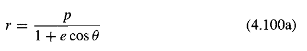
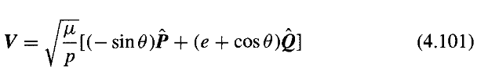

# Notes

* account for control constraints (max & min thrust)

## Questions

* Lambert problem?
* w, u (equations of motion)?

## Variables

* $p$: semi-latus rectum 

  * $p = \frac{h^2}{\mu} = \frac{b^2}{a} = a e^2$
* $n$: mean motion

  * $n = \sqrt{\frac{\mu}{a^3}}$

## Relations between anomalies

Mean anomaly (Kepler orbit):

$M = n(t - \tau)$

where $\tau$ is time of perigee passage.

Eccentric anomaly $E$:

$M = E - e \sin{E}$

True anomaly $\theta$:

$\tan{\frac{\theta}{2}} = \left(\frac{1+e}{1-e}\right)^{1/2} \tan{\frac{E}{2}}$

Not always in the same quadrant as $E$ but always: $0 \leq E \leq \pi \iff 0 \leq \theta \leq \pi$

## Relations of orbital quantities

## Equations of motion

w, u?

## Transformations

pág. 73 pdf chobotov

## Chapter 5 Orbital Maneuvers

* require phasing or not?

  * if not, time can be excluded from equations

### 5.3 Transfer between coplanar elliptical orbits

reproduce difference between 1 impulse & 2 impulse?

### 5.4 Hohmann transfer

Optimal 2 impulse transfer: reproduce?

### 5.5 Bi-elliptic transfer

Optimal $r_2/r_1$ ratio is $\infty$. Discuss when it is better than Hohmann?
Useful for plane changes!!!! - how to show this?

### 5.6 Restricted Three Impulse Plane Change

TODO Understand $\rho_{opt}$

### 5.7 General Three Impulse Plane Change

Better in some cases, not always (TODO review 5.6!!!)

### 5.10 Coplanar elliptic transfer

No easy general solution! 